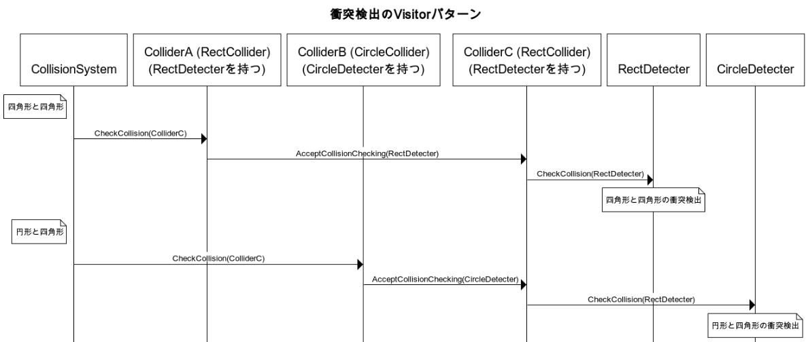

# 衝突システムについて

* 衝突検出と衝突応答を行うシステムです。
* 機能はすごく限ります。回転していない四角形コライダー同士の衝突しか適用できません。
* Unityの`RigidBody`のような機能がありません。つまり、速度や重量などがなくて、今のフレームにコライダーたちの現状だけ衝突処理を行います。

## 仕組み

* `CollisionSystem`：シーンの中のすべての`Collider`コンポーネントの参照(厳密に言うと生ポインタ)を記録し、毎フレームに`OnStartCollision()`関数を行い、衝突検出を行なってから衝突応答を行います。
* `Collider`：Unityの`Collider`と似ています。抽象クラスです。`onCollided`と`onTriggered`二つのイベントを持っています。
* `RectCollider`：現在支援している唯一の`Collider`の実装です。
* `CollisionLayer`：Unityの`Layer`と似ています。`std::uint32_t`のエイリアスです。
* `CollisionLayerMatrix`：どんな`CollisionLayer`の組み合わせに衝突処理を行うかの設定です。
* `Detection`
	* `Detector`：`Collider`コンポーネントの中身を複雑にならないように、Visitorパターンの`CheckCollision()`関数を`Collider`から分かれるクラスです。抽象クラスです。
	* `RectDetector`：`RectCollider`が持っている`Detector`の実装です。
	* `DetectorImpl`：衝突検出と衝突応答の実装を`Detector`から分かれるために用意したPimplイディオムです。
	* `DetectorFactory`：`DetectorImpl`の実装を指定する仕組みです。
	* `CollisionRecord`：衝突が起こるとき、後の衝突応答の計算にとっては必須の記録です。衝突システムの実装によって違います。
	* `NonRotatedRectSimpleImpl`：現在の衝突システムの実装です。

## 衝突検出のVisitorパターンの説明

* 違う`Collider`の種類によって、衝突検出の実装も違います。例えば、四角形同士の衝突検出と円形同士の衝突検出と違います。
* `Collider`の種類の組み合わせごとに衝突検出の関数を分けるように、Visitorパターンを使います。
* 下記の図でVisitorパターンの流れに載っています。ただし、見やすくなるために、下記の図は簡略化して、実際のコードと違いがあります。また、現在`RectCollider`しか支援していません。図の中の`CircleCollider`と`CircleDetecter`は存在しないです。
  
* ちょっと複雑と見えるかもしれないが、この仕組みに沿って、拡張しやすくなります。
* 例えば、`CircleCollider`を追加したい場合、以下の手順に従うとできます。
	1. 衝突システムの実装(例えば、`NonRotatedRectSimpleImpl`)に、円形同士の衝突検出関数と円形と四角形の衝突検出関数を追加します。
	2. `Detector`の中に円形との`CheckCollision()`virtual関数をオーバーロードします。
	3. `CircleDetector`を追加し、`Detector`の`CheckCollision()`関数たちをオーバーライドします。
	4. `RectDetector`も円形との`CheckCollision()`関数をオーバーライドします。
	5. `CircleCollider`を追加し、`CircleDetector`を紐付けます。
* 上の例の通り、衝突検出の関数を分けるためのswitch文の必要がありません。
* `CollisionSystem`とか`RectCollider`とか実装したクラスも変更しないままで済みます。追加しなければならないコードを`Detector`によってちゃんと分けます。

## `NonRotatedRectSimpleImpl`実装の説明

### 衝突検出

* [ソースコード](../../src/GE/Collision/Detection/NonRotatedRectSimpleImpl/DetectorImpl_RectRect.cpp)
* 回転を無視します。
* 四角形コライダー同士の衝突しか支援しません。
* つまり、AABB(axis-aligned bounding box)の当たり判定を行います。
* コライダーが重なっている場合、コライダーたちのセンターによって調整方向を決定し、調整量(`CollisionRecord`)を計算します。
	* 一つのコライダーだけ移動できる：移動できるコライダーの`CollisionRecordHandler`に調整量を記録します。
	* 二つのコライダーも移動できる：調整量を半分に割って、コライダーたちの`CollisionRecordHandler`に記録します。
* 下記の図を例にして説明します。
  
* `A`と`B`は移動できないコライダー、`C`は移動できるコライダーとします。
* 説明を分かりやすくなるために、
	* "右x単位<u>または</u>上y単位"という意味を`(x, y)`と表記します。
	* "右x単位<u>かつ</u>上y単位"という意味を`[x, y]`と表記します。
* `C`と`A`が重なっているので、調整量"右4単位または上5単位"`(4, 5)`を記録します(緑の矢印)。
* `C`と`B`が重なっているので、調整量"右11単位または下3単位"`(11, -3)`を記録します(青い矢印)。
* つまり、衝突検出段階後、`C`の`CollisionRecordHandler`の中に、二つの調整量を持っています(`(4, 5)`、`(11, -3)`)。

### 衝突応答

* [ソースコード](../../src/GE/Collision/Detection/NonRotatedRectSimpleImpl/CollisionRecordHandler.cpp)
* 上記の例を続けて説明します。
* 衝突応答段階を行うとき、まず可能な調整方法のリストを作ります。
	* 最初のリストの中に、`[0, 0]`だけ入ります。
	* それから、記録した調整量をループして、リストの中のすべての調整方法を比べたら、より正確な調整方法を得ます。
	* 1回目：`(4, 5)`とリスト(`[0, 0]`)を比べます：
		* x成分：調整方法は`[0, 0]`から`[4, 0]`になります。
		* y成分：調整方法は`[0, 0]`から`[0, 5]`になります。
		* つまり、リストは(`[0, 0]`)から(`[4, 0]`、`[0, 5]`)になります。
	* 2回目：`(11, -3)`とリスト(`[4, 0]`、`[0, 5]`)を比べます：
		* x成分：調整方法は
			* `[4, 0]`から`[11, 0]`になります。
			* `[0, 5]`から`[11, 5]`になります。
		* y成分：調整方法は
			* `[4, 0]`から`[4, -3]`になります。
			* `[0, 5]`のy成分は正数、`(11, -3)`のy成分は負数なので、この調整方法は矛盾があり、破棄します。
	* 最終のリストの中に、`[11, 0]`、`[11, 5]`、`[4, -3]`三つの可能な調整方法があります。
* 一番短い移動距離(平方距離)の調整方法を選んで、実際の衝突応答をします。
	* 上の例は`[4, -3]`、つまり"右4単位かつ下3単位"に調整します。

## 参照

* [ソースコード](../../src/GE/Collision)
* [`Collider`の使用例](../../src/Prefab/Map/MapObject/GoalObjectPrefab.cpp)
* [`Collider`の`onTriggered`の使用例](../../src/Map/MapObject/GoalObject.cpp)
* [`CollisionLayerMatrix`の使用例](../../src/Collision/CollisionInfo.h)