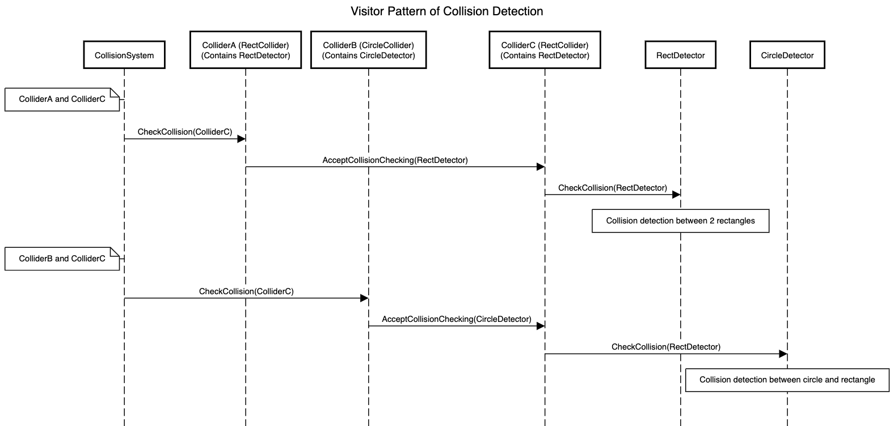
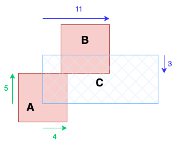

# About Collision System

* The system that is responsible for collision detection and collision response.
* The features are very limited. It only supports collisions between non-rotated rectangle colliders.
* It does not contains any features like `RigidBody` in Unity. That is, there is no concept about speed or weight. The behaviour onlys depend on the situation of current frame.

## Structures

* `CollisionSystem` : Record all references (to be precise, raw pointers) of all `Collider` components of the scene, and call `OnStartCollision()` method on each frame to do the collision detection and handle the collision response.
* `Collider` : An abstract class that is similar to the `Collider`in Unity. It contains `onCollided` and `onTriggered` events.
* `RectCollider` : The only supported `Collider` implementation now.
* `CollisionLayer` : Similar to the `Layer` in Unity. It is just an alias of `std::uint32_t`.
* `CollisionLayerMatrix` : The setting of which `CollisionLayer` can collide with which `CollisionLayer`.
* `Detection`
	* `Detector` : To order to keep the `Collider` component simple, separate `CheckCollision()` method from `Collider` by visitor pattern and put it into `Detector` class. It is an abstract class.
	* `RectDetector` : The `Detector` implementation inside `RectCollider`.
	* `DetectorImpl` : The Pimpl idiom that is to separate the implementation of collision detection and collision response from `Detector`.
	* `DetectorFactory` : To assign the `DetectorImpl` implementation.
	* `CollisionRecord` : For the calculation of collision response, a `CollisionRecord` is needed to be recorded while a colision occurs. The structure of `CollisionRecord` depends on the implementation of the collision system.
	* `NonRotatedRectSimpleImpl` : Current implementation of collision system.

## Explanation of the Visitor Pattern of Collision Detection

* For different type of `Collider`, the logic of collision detection would be different. For example, the collision detection of 2 rectangles and the collision detection of 2 circles are different.
* Visitor pattern is used to manage all the collision detections due to the combination of different type of `Collider`.
* Below figure shows the flow of the visitor pattern. However, to make it easier to read, the flow in the figure is simplified and is not exactly the same as the actual codes. Also, currently only `RectCollider` is supported. The `CircleCollider` and `CircleDetecter` from the figure is not existing.
   
* This structure may look a bit complicated, but with this structure, we can easily expand the collision system.
* For example, when you want to add `CircleCollider` into the collision system, you can follow below steps.
	1. Within the implementation of the collision system (e.g., `NonRotatedRectSimpleImpl`), add the methods of collision detection for 2 `CircleColliders` and for 1 `CircleCollider` and 1 `RectCollider`.
	2. Add overload methods about `CircleColliders` to the `CheckCollision()` virtual methods of `Detector`.
	3. Add `CircleDetector` class and override the `CheckCollision()` methods of `Detector`.
	4. Also, inside `RectDetector`, override the `CheckCollision()` method with `CircleColliders`.
	5. Add `CircleCollider` class and set `CircleDetector` as its detector.
* As you can see in above example, there is no need to use condition (e.g., `switch`) to decide which collision detection method to be used.
* Also, there is no need to modify most of the implemented classes, such as `CollisionSystem` and `RectCollider`. All the codes needed to be changed are separated and placed into `Detector` related classes.

## Explanation of the implementation of `NonRotatedRectSimpleImpl`

### Collision Detection

* [Source Code](../../src/GE/Collision/Detection/NonRotatedRectSimpleImpl/DetectorImpl_RectRect.cpp)
* Ignore rotation.
* Only support collision of 2 rectangle colliders.
* That is, check the collision of AABB(axis-aligned bounding box).
* If 2 colliders overlap, decide the adjustment based on the centers of the colliders, and calculate the adjustment value (`CollisionRecord`).
	* If only 1 collider can move : Record the adjustment value into the `CollisionRecordHandler` of the movable collider.
	* If both of the colliders can move : Half the adjustment value and record it into the `CollisionRecordHandler` of both colliders.
* Use below figure for explanation.
  
* `A` and `B` are non-movable colliders. `C` is movable collider.
* To make it easier to understand,
	* use `(x, y)` to represent "x units rightward <u>or</u> y units upward"
	* use `[x, y]` to represent "x units rightward <u>and</u> y units upward"
* Because `C` and `A` overlap, record the adjustment value "4 units rightward or 5 units upward"`(4, 5)` (The green arrow).
* Because `C` and `B` overlap, record the adjustment value "11 units rightward or 3 units downward"`(11, -3)` (The blue arrow).
* That is, after the collision detection, there are 2 adjustment values (`(4, 5)`、`(11, -3)`) inside `CollisionRecordHandler` of `C`.

### Collision Response

* [Source Code](../../src/GE/Collision/Detection/NonRotatedRectSimpleImpl/CollisionRecordHandler.cpp)
* Use above example to continue the explanation.
* First, calculate and list out all of the possible adjustment methods.
	* At the beginning, the list of adjustment methods only contains `[0, 0]`.
	* Then, loop through all of the adjustment values to compare with the list and obtain more accurate adjustment methods.
	* First adjustment value : Compare `(4, 5)` with the list (`[0, 0]`) :
		* x-axis : Get an adjustment method from `[0, 0]` to `[4, 0]`.
		* y-axis : Get an adjustment method from `[0, 0]` to `[0, 5]`.
		* That is, the list changed from (`[0, 0]`) to (`[4, 0]`、`[0, 5]`).
	* Second adjustment value : Compare `(11, -3)` with the list (`[4, 0]`、`[0, 5]`) :
		* x-axis : Get adjustment methods
			* from `[4, 0]` to `[11, 0]`
			* from `[0, 5]` to `[11, 5]`
		* y-axis : Get adjustment methods
			* from `[4, 0]` to `[4, -3]`
			* the y-axis value of `[0, 5]` is positive and that of `(11, -3)` is negative. Because there is contradiction in this adjustment method, give up this method.
	* So at the end, the list contains 3 possible adjustment methods (`[11, 0]`、`[11, 5]`、`[4, -3]`).
* Choose the adjustment method with the shortest movement distance (square distance) and do the collision response.
	* In above case, choose `[4, -3]`. That is, adjust by "4 units rightward and 3 units downward".

## References

* [Source Code](../../src/GE/Collision)
* [Example of `Collider`](../../src/Prefab/Map/MapObject/GoalObjectPrefab.cpp)
* [Example of `onTriggered` of `Collider`](../../src/Map/MapObject/GoalObject.cpp)
* [Example of `CollisionLayerMatrix`](../../src/Collision/CollisionInfo.h)